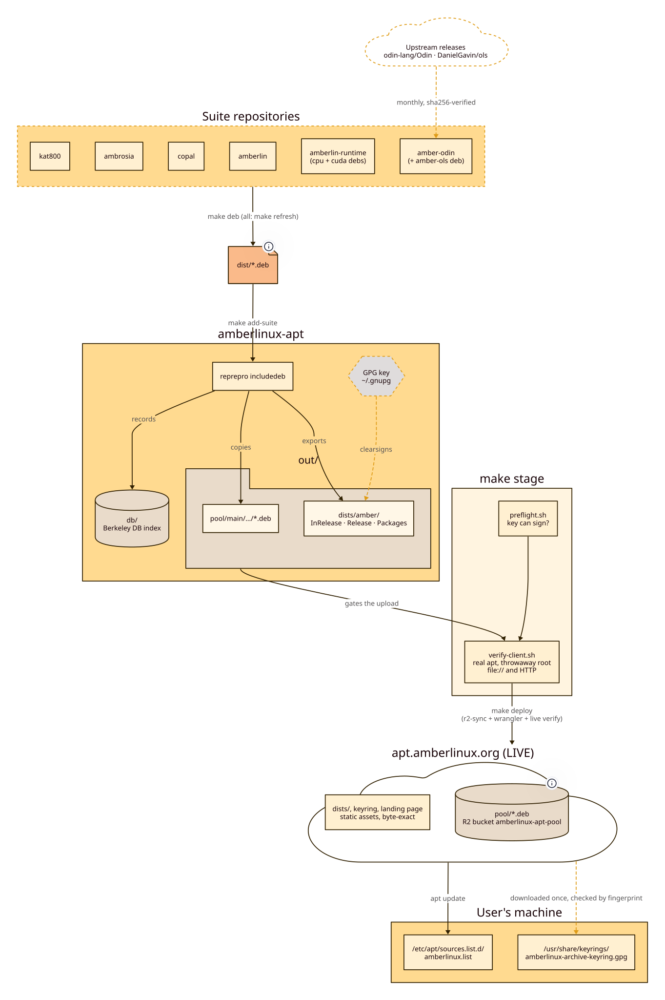

# ARCHITECTURE — how the archive is built

`SPEC.md` is what the archive is. This is how it is produced, signed and
checked. `DEPLOY.md` covers getting it online, `PACKAGING.md` the contract with
the projects that feed it.



## Layout

```
conf/distributions     the suite definition and the signing fingerprint
conf/options           outdir +b/out — reprepro writes into out/, not the repo root
db/                    reprepro's Berkeley DB index          (generated, gitignored)
out/                   the publishable static tree            (generated, gitignored)
  dists/amber/         InRelease, Release, Release.gpg, main/binary-amd64/Packages[.gz]
  pool/main/<l>/<pkg>/ the .deb files
  amberlinux-archive-keyring.gpg
tools/preflight.sh     refuse to touch the archive unless it can be signed
tools/verify-client.sh apt against a throwaway root, over file:// or HTTP
tools/lint.sh          repository and documentation hygiene
diags/              d2 sources with their committed SVGs
```

Only the configuration, the scripts and the docs are committed. `out/` and `db/`
are both **generated**: `db/` is meaningless without the pool it indexes, and
the pool will eventually hold model weights. Either is rebuilt by re-ingesting
the `.deb` files, which is what `make add-suite` does. `tools/lint.sh` fails if
they are ever tracked.

Publishing therefore always happens on the machine holding the private key,
which is where it has to happen anyway.

## Key handling

The private key lives in the maintainer's **default GPG keyring** (`~/.gnupg`)
on the publishing machine. It has **no passphrase**, so `make stage` runs
unattended — which means the machine's disk is the only thing protecting it. It
is never committed, and nothing in this repository will ever contain it. The
only key material that ships is the exported public keyring, generated into
`out/` by `make keyring`.

`conf/distributions`' `SignWith:` line is the single place the fingerprint is
written; the Makefile and both scripts read it from there.

`tools/preflight.sh` runs before every archive operation and aborts unless:

- `reprepro` and `gpg` are installed;
- `conf/distributions` names a fingerprint;
- that secret key is in the default keyring;
- it can **actually produce a signature** with `--pinentry-mode error` — listing
  a key is not enough, since it can be expired, revoked or passphrase-locked;
- the fingerprint printed in `README.md` matches.

Publishing an unsigned or wrongly-signed tree is not possible by accident. The
failure it exists to prevent is silent: a missing key yields a tree that only
breaks on the user's machine, at `apt update`.

`make keyring` refuses to run with an empty fingerprint, because
`gpg --export` with no argument exports *every* public key in the keyring into a
file we publish.

### Rotating the key

1. Generate the new key in the publishing machine's default keyring.
2. Update `SignWith:` in `conf/distributions`.
3. Update the fingerprint in `README.md` and `docs/SPEC.md`. `make lint` checks
   every tracked `.md` against `conf/distributions`, so a missed one fails
   rather than shipping a fingerprint users would check against the wrong key.
4. `make stage`, then deploy.
5. Tell users to re-download the keyring. There is no in-band rotation: apt
   trusts the keyring file, and the file is fetched over HTTPS, not signed by
   the old key.

## Adding a package

```sh
make add-suite                       # every suite repo, current build
make add DEB=path/to/one.deb         # or a single file
make stage
```

`add-suite` asks each repo in the Makefile's `SUITE` list for `make deb-path`,
which prints the absolute path of every package that repo publishes. The archive
never hardcodes another repo's output layout; `PACKAGING.md` is the contract and
`make lint` checks that every listed repo answers it.

**reprepro refuses to re-include a version it already holds unless the bytes are
identical**, and a rebuild is rarely byte-identical — the amberlin-runtime
package differed by two bytes between two builds of the same source. `add-suite`
therefore drops a package before re-adding it. Doing that by hand is
`make remove PKG=… && make add DEB=…`; the error you are working around reads
`Already existing files can only be included again, if they are the same`.

Prefer bumping the version. `make remove` deletes the pool file, which is the
one thing that breaks the immutability a published archive promises — see
`DEPLOY.md` § Atomicity.

## Verification

```sh
make check         # preflight: reprepro, the key, the README fingerprint
make lint          # fingerprints, untracked out/ and db/, diagram freshness, suite contract
make verify        # apt against a throwaway root over file://
make verify-http   # the same over real HTTP, from a local server
make stage       # export + sign + both verifies
make ci            # lint + publish
```

`verify` builds a throwaway apt root — its own `sources.list`, `lists`, `status`
and cache — whose only source is `out/` and whose only trusted key is the
shipped keyring, runs `apt-get update`, and downloads every package reprepro
lists. It checks the `InRelease` signature with `gpgv` first, because that is
what apt itself uses, and it greps the update log afterwards because apt
downgrades some trust failures to a warning and still exits 0.

`verify-http` is the same over HTTP, which `file://` cannot substitute for: a
file URL cannot redirect, cannot re-encode, and cannot return an HTML 404 page
with a 200 status. Those are precisely the CDN failure modes `DEPLOY.md` is
designed around, so it additionally asserts, before involving apt at all, that
the extension-less index files come back with no redirect and bytes identical to
`out/`, that `Packages.gz` carries no `Content-Encoding`, and that a missing
path is a real 404. `BASE=https://…` points the same assertions at a deployment.

## Diagrams

d2 sources in `diags/`, rendered beside them, both committed — reading the
repository does not need d2 installed. `make diags` regenerates with the
suite's themes (`105` light, `300` dark); `make lint` fails if the SVG has
drifted from its source.

## Freshness

`tools/verify-fresh.sh` compares the SHA256 of every package in the exported
index against what each `SUITE` repo's `make deb-path` reports, and
fails `stage` when the archive is older. `verify-client.sh` cannot see this:
a stale archive is signed, consistent and installable — it just serves
yesterday's binary. A package absent from the archive is reported but does not
fail, because apt tells the user immediately.
